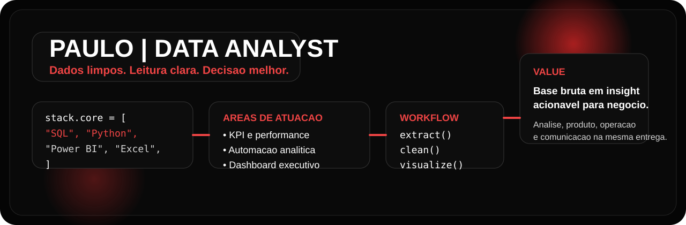

<div align="center">
  
</div>

<br />

<h1 align="center">Paulo | Data Analyst</h1>

<p align="center">
  <strong>Transformando dados em leitura clara, insight acionavel e decisao melhor.</strong>
</p>

<p align="center">
  
  
  
  
</p>

<p align="center">
  <a href="https://www.linkedin.com/">
    
  </a>
  <a href="mailto:seuemail@exemplo.com">
    
  </a>
  
</p>

---

## About Me

<table>
  <tr>
    <td valign="top" width="58%">

```text
Analista de dados com foco em transformar bases complexas
em indicadores, diagnosticos e recomendacoes acionaveis.

Atuo na interseccao entre:

-> negocio
-> performance
-> operacao
-> produto
-> visualizacao executiva
```

**O que voce encontra aqui**

- Analises para responder perguntas de negocio com objetividade.
- Dashboards que simplificam leitura e acompanhamento de performance.
- Consultas SQL para extracao, consistencia e confianca de dado.
- Scripts em Python para limpeza, consolidacao e automacao.
- Projetos com foco em impacto, clareza e melhoria continua.

    </td>
    <td valign="top" width="42%">

```yaml
name: Paulo
role: Data Analyst
base: Brazil
working_with:
  - SQL
  - Python
  - Power BI
  - Excel
  - Pandas
priority:
  - business impact
  - clean communication
  - repeatable analysis
currently_learning:
  - forecasting
  - experimentation
  - advanced storytelling
```

  </td>
  </tr>
</table>

## Tech Stack

<p align="center">
  
</p>

<p align="center">
  
  
  
  
  
  
</p>

<div align="center">

```text
extract -> clean -> explore -> model -> visualize -> explain -> improve
```

</div>

## Dashboard Panel

<div align="center">
  
  
</div>

<div align="center">
  
</div>

## What I Build

<table>
  <tr>
    <td valign="top" width="50%">
      <h3>Analytics Dashboards</h3>
      <pre>KPI tracking
Trend analysis
Operational visibility
Executive summaries</pre>
    </td>
    <td valign="top" width="50%">
      <h3>SQL Intelligence</h3>
      <pre>Data extraction
Validation logic
Segmentation
Performance diagnosis</pre>
    </td>
  </tr>
  <tr>
    <td valign="top" width="50%">
      <h3>Python Automation</h3>
      <pre>Cleaning pipelines
Recurring reports
Data consolidation
Process acceleration</pre>
    </td>
    <td valign="top" width="50%">
      <h3>Business Reports</h3>
      <pre>Actionable insight
Decision support
Context-rich reporting
Clear communication</pre>
    </td>
  </tr>
</table>

## Featured Projects

<table>
  <tr>
    <td width="50%">
      
      <br />
      Painel para leitura de meta, variacao, gargalos e performance por periodo.
      <br /><br />
      <a href="https://github.com/MASTERJUDAH">
        
      </a>
    </td>
    <td width="50%">
      
      <br />
      Estudos com query, criterio de negocio e leitura orientada a tomada de decisao.
      <br /><br />
      <a href="https://github.com/MASTERJUDAH">
        
      </a>
    </td>
  </tr>
  <tr>
    <td width="50%">
      
      <br />
      Scripts para tratamento, consolidacao e entrega recorrente de dados confiaveis.
      <br /><br />
      <a href="https://github.com/MASTERJUDAH">
        
      </a>
    </td>
    <td width="50%">
      
      <br />
      Relatorios para acompanhamento de operacao, resultado e oportunidades de melhoria.
      <br /><br />
      <a href="https://github.com/MASTERJUDAH">
        
      </a>
    </td>
  </tr>
</table>

## Data Mindset

<div align="center">

| Step | Goal |
|------|------|
| Collect | capturar o dado certo |
| Clean | remover ruido e inconsistencia |
| Explore | encontrar padroes e desvios |
| Explain | traduzir achado em linguagem de negocio |
| Improve | apoiar acao com base em evidencia |

</div>

## Contribution Graph

<div align="center">
  
</div>

## Contact

<p align="center">
  <a href="https://www.linkedin.com/">
    
  </a>
  <a href="mailto:seuemail@exemplo.com">
    
  </a>
</p>

<p align="center">
  <sub>Se quiser, troque os links, username e descricoes dos projetos pelos seus dados reais.</sub>
</p>
