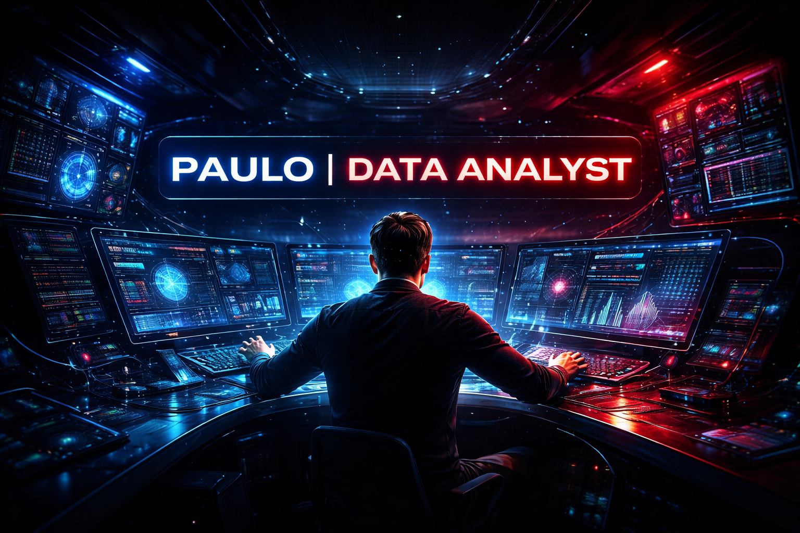

<div align="center">
  
</div>

<br />

<h1 align="center">Paulo Hr. Lamoréa | Analista de Dados</h1>

<p align="center">
  <strong>Transformando dados em leitura clara, insight acionável e decisão melhor.</strong>
</p>

<p align="center">
  
  
  
  
</p>

<p align="center">
  <a href="https://www.linkedin.com/">
    
  </a>
  <a href="mailto:seuemail@exemplo.com">
    
  </a>
  
</p>

---

## Sobre Mim

<table>
  <tr>
    <td valign="top" width="58%">

```text
Analista de dados com foco em transformar bases complexas
em indicadores, diagnosticos e recomendacoes acionaveis.

Atuo na interseccao entre:

-> negocio
-> performance
-> operacao
-> produto
-> visualizacao executiva
```

**O que voce encontra aqui**

- Analises para responder perguntas de negocio com objetividade.
- Dashboards que simplificam leitura e acompanhamento de performance.
- Consultas SQL para extracao, consistencia e confianca de dado.
- Scripts em Python para limpeza, consolidacao e automacao.
- Projetos com foco em impacto, clareza e melhoria continua.

    </td>
    <td valign="top" width="42%">

```yaml
name: Paulo
role: Analista de Dados
base: Brazil
working_with:
  - SQL
  - Python
  - Power BI
  - Excel
  - Pandas
priority:
  - business impact
  - clean communication
  - repeatable analysis
currently_learning:
  - forecasting
  - experimentation
  - advanced storytelling
```

  </td>
  </tr>
</table>

## Stack Tecnica

<p align="center">
  
</p>

<p align="center">
  
  
  
  
  
  
</p>

<div align="center">

```text
extract -> clean -> explore -> model -> visualize -> explain -> improve
```

</div>

## Painel GitHub

<div align="center">
  
  
</div>

<div align="center">
  
</div>

## O Que Eu Construo

<table align="center" width="100%">
  <tr>
    <td valign="top" width="50%">
      <h3>Dashboards Analiticos</h3>
      <pre>Acompanhamento de KPIs
Analise de tendencias
Visibilidade operacional
Resumo executivo</pre>
    </td>
    <td valign="top" width="50%">
      <h3>Inteligencia em SQL</h3>
      <pre>Extracao de dados
Logica de validacao
Segmentacao
Diagnostico de performance</pre>
    </td>
  </tr>
  <tr>
    <td valign="top" width="50%">
      <h3>Automacao com Python</h3>
      <pre>Pipeline de limpeza
Relatorios recorrentes
Consolidacao de dados
Aceleracao de processos</pre>
    </td>
    <td valign="top" width="50%">
      <h3>Relatorios de Negocio</h3>
      <pre>Insight acionavel
Apoio a decisao
Relatorio com contexto
Comunicacao clara</pre>
    </td>
  </tr>
</table>

## Projetos em Destaque

<table align="center" width="100%">
  <tr>
    <td width="50%">
      
      <br />
      Limpeza e padronizacao de dados em Excel com macro aplicada a cenarios de marketplace analytics.
    </td>
    <td width="50%">
      
      <br />
      Tratamento de dados com Pandas para acelerar limpeza, consolidacao e preparacao analitica.
    </td>
  </tr>
  <tr>
    <td width="50%">
      
      <br />
      Base inicial em SQL para estudo, modelagem relacional, consultas e evolucao de estrutura de dados.
    </td>
    <td width="50%">
      
      <br />
      Fluxo de coleta, tratamento e organizacao de dados para alimentar analise e tomada de decisao.
    </td>
  </tr>
  <tr>
    <td width="50%">
      
      <br />
      Robo de dados para capturar informacoes relevantes da web e estruturar insumos para analise.
    </td>
    <td width="50%">
      
      <br />
      Padronizacao de titulos, categorias e atributos de produtos para melhorar qualidade e comparabilidade.
    </td>
  </tr>
  <tr>
    <td width="50%">
      
      <br />
      Dashboard voltado a inteligencia de mercado com leitura de concorrencia, preco e oportunidade.
    </td>
    <td width="50%">
      
      <br />
      Sistema para analisar produtos, identificar padroes e apoiar decisoes com base em evidencias.
    </td>
  </tr>
  <tr>
    <td width="50%">
      
      <br />
      Motor de recomendacao para sugerir produtos ou acoes a partir de comportamento e contexto.
    </td>
    <td width="50%">
      
      <br />
      Sistema de automacao inteligente para reduzir trabalho manual e escalar tarefas analiticas.
    </td>
  </tr>
</table>

## Mentalidade Analitica

<div align="center">

| Etapa | Objetivo |
|------|------|
| Coletar | capturar o dado certo |
| Limpar | remover ruido e inconsistencia |
| Explorar | encontrar padroes e desvios |
| Explicar | traduzir achado em linguagem de negocio |
| Melhorar | apoiar acao com base em evidencia |

</div>

## Grafico de Contribuicao

<div align="center">
  
</div>

## Contato

<p align="center">
  <a href="https://www.linkedin.com/">
    
  </a>
  <a href="mailto:seuemail@exemplo.com">
    
  </a>
</p>

<p align="center">
  <sub>Se quiser, troque os links, username e descricoes dos projetos pelos seus dados reais.</sub>
</p>
